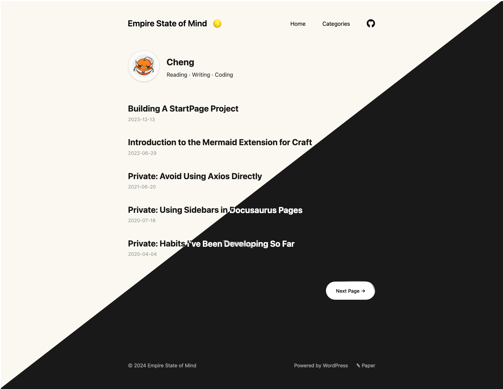

<div align="center">
<h1>Paper</h1>

A simple, clean, customizable WordPress theme transplants from the Hugo theme [hugo-paper](https://github.com/nanxiaobei/hugo-paper).
</div>

---
<div align="center">



</div>

## Features

### Customizable
- Customizable profiles, social links, and more.


## Develop
1. Make sure you have [Node.js](https://nodejs.org/), [PNPM](https://pnpm.io/), [Docker](https://www.docker.com/), [PHP](https://www.php.net/), [Composer](https://getcomposer.org/) installed.

2. Clone the repository and install the dependencies:
   ```bash
   git clone https://github.com/huangcheng/wordpress-theme-paper
   
   composer install
   
   pnpm install
    ```
   
3. Build locale assets:
   ```bash
   pnpm run build:i18n
   ```
   
4. Build the stylesheet:
   ```bash
   pnpm run build:css
   ```

5. Start the development server:
   ```bash
   pnpm run start
   ```
   
To build the theme for production, run `pnpm run build`.

## Installations
1. Download the latest release from the [releases page](https://github.com/huangcheng/wordpress-theme-paper/releases).

2. Go to the WordPress admin panel, click on "Appearance" and then "Themes".

3. Click on "Add New" and then "Upload Theme".

4. Choose the downloaded zip file and click "Install Now".

5. After installation, click on "Activate".

## Links
- [hugo-paper](https://github.com/nanxiaobei/hugo-paper)
